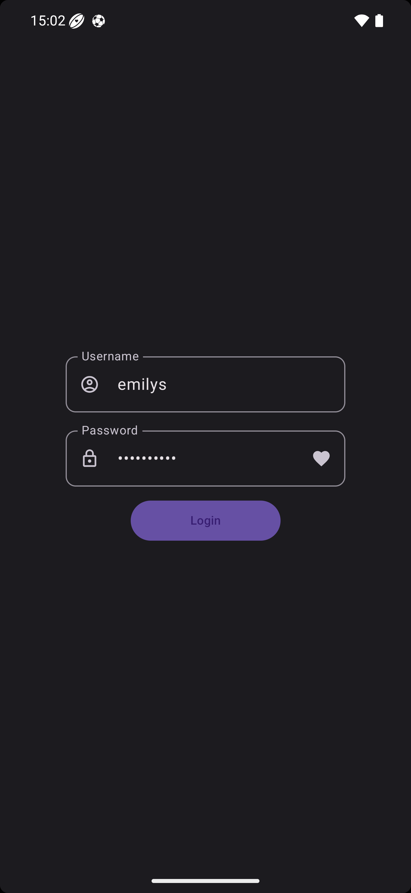

# Android-Compose-Ecommerce

A modern Android e-commerce application built with **Jetpack Compose** demonstrating Clean Architecture, MVVM pattern, and modern Android development best practices.


<p align="center">
  
  &nbsp;&nbsp;&nbsp;&nbsp;
  
  &nbsp;&nbsp;&nbsp;&nbsp;
  
</p>

## Features

- **User Authentication** - Secure login with encrypted credential storage
- **Product Catalog** - Browse products with categories
- **Search & Filter** - Search products, filter by category, sort by price/rating/title
- **Product Details** - View detailed product information with image gallery
- **Favourites** - Mark and manage favourite products
- **Pull-to-Refresh** - Swipe down to refresh content
- **Offline Support** - Local-first approach with Room database caching
- **Dark Mode** - Supports system theme preferences

---

## Tech Stack & Tools

### Core

| Technology | Version | Purpose |
|------------|---------|---------|
| **Kotlin** | 2.0.0 | Primary programming language |
| **Jetpack Compose** | BOM 2024.04.01 | Modern declarative UI toolkit |
| **Material Design 3** | Latest | UI components and theming |
| **Compose Navigation** | 2.9.5 | Type-safe navigation |

### Architecture & DI

| Library | Version | Purpose |
|---------|---------|---------|
| **Koin** | 4.1.0 | Dependency injection framework |
| **Koin Compose** | 4.1.0 | Compose integration for Koin |
| **ViewModel** | 2.6.1 | Lifecycle-aware state management |
| **Kotlin Coroutines** | - | Asynchronous programming |
| **Kotlin Flow** | - | Reactive data streams |

### Networking

| Library | Version | Purpose |
|---------|---------|---------|
| **Retrofit** | 2.11.0 | Type-safe HTTP client |
| **OkHttp** | 4.12.0 | HTTP client & interceptors |
| **Gson Converter** | 2.11.0 | JSON serialization |

### Local Storage

| Library | Version | Purpose |
|---------|---------|---------|
| **Room** | 2.8.4 | SQLite database abstraction |
| **KSP** | 2.0.0-1.0.24 | Kotlin Symbol Processing for Room |
| **Encrypted SharedPreferences** | 1.1.0 | Secure credential storage (AES-256) |

### Image Loading

| Library | Version | Purpose |
|---------|---------|---------|
| **Coil** | 2.4.0 | Image loading library |
| **Coil SVG** | 2.4.0 | SVG support |

### UI Utilities

| Library | Version | Purpose |
|---------|---------|---------|
| **SDP Compose** | 1.1.0 | Scalable size units for responsive UI |

### Testing

| Library | Purpose |
|---------|---------|
| **JUnit 4** | Unit testing |
| **Espresso** | UI testing |
| **Compose UI Test** | Compose testing utilities |

### Build Tools

| Tool | Version |
|------|---------|
| **Android Gradle Plugin** | 8.7.2 |
| **Kotlin Plugin** | 2.0.0 |
| **KSP Plugin** | 2.0.0-1.0.24 |
| **Room Plugin** | 2.8.4 |

---

## Architecture

This project follows **Clean Architecture** with **MVVM** pattern, ensuring separation of concerns and testability.

```
┌─────────────────────────────────────────────────────────────┐
│                     Presentation Layer                       │
│  ┌─────────────┐  ┌─────────────┐  ┌─────────────────────┐  │
│  │   Screen    │──│  ViewModel  │──│      UI State       │  │
│  │ (Composable)│  │             │  │   (Immutable)       │  │
│  └─────────────┘  └─────────────┘  └─────────────────────┘  │
├─────────────────────────────────────────────────────────────┤
│                       Domain Layer                           │
│  ┌─────────────────────────────────────────────────────┐    │
│  │                     Use Cases                        │    │
│  │            (Business Logic & Data Mapping)           │    │
│  └─────────────────────────────────────────────────────┘    │
├─────────────────────────────────────────────────────────────┤
│                        Data Layer                            │
│  ┌──────────────────┐           ┌──────────────────┐        │
│  │   Remote Repo    │           │    Local Repo    │        │
│  │   (Retrofit)     │           │  (Room + Prefs)  │        │
│  └──────────────────┘           └──────────────────┘        │
│              └────────────┬────────────┘                    │
│                    ┌──────┴──────┐                          │
│                    │  Repository │                          │
│                    │   (Impl)    │                          │
│                    └─────────────┘                          │
└─────────────────────────────────────────────────────────────┘
```

### Project Structure

```
app/src/main/java/com/example/myapplication/
├── config/
│   ├── components/              # Reusable Compose components
│   ├── theme/                   # Material 3 theming
│   └── utils/                   # Utility classes & extensions
├── core/
│   ├── local/
│   │   ├── room/                # Room database & DAOs
│   │   └── pref/                # Encrypted SharedPreferences
│   └── remote/                  # Base remote repository & API config
├── di/                          # Koin dependency injection modules
├── models/
│   └── response/                # API response models
├── navigation/                  # Navigation graphs & routes
└── ui/
    ├── landing/
    │   ├── splash/              # Splash screen
    │   └── intro/               # Intro screen
    ├── auth/
    │   ├── login/
    │   │   ├── data/local/      # Local data source
    │   │   ├── data/remote/     # Remote data source
    │   │   ├── domain/          # Use cases
    │   │   └── presentation/    # Screen, ViewModel, UI State
    │   └── signup/
    ├── dashboard/
    │   ├── home/
    │   │   ├── data/local/      # Room operations
    │   │   ├── data/remote/     # API calls
    │   │   ├── domain/          # Use cases
    │   │   └── presentation/    # Screen, ViewModel, UI State
    │   ├── favourite/           # Favourites screen
    │   └── profile/             # Profile screen
    └── product_detail/
        ├── data/local/
        ├── data/remote/
        ├── domain/
        └── presentation/
```

---

## Key Implementation Highlights

### Local-First Data Strategy
```kotlin
// Repository emits cached data first, then fetches fresh data
flow {
    // 1. Emit local data
    val localData = localRepo.getProducts()
    if (localData.isNotEmpty()) emit(Result.success(localData))

    // 2. Fetch remote data
    val remoteData = remoteRepo.getProducts()

    // 3. Sync to local database
    localRepo.saveProducts(remoteData)

    // 4. Emit fresh data
    emit(Result.success(remoteData))
}
```

### Encrypted SharedPreferences
```kotlin
// AES-256 encryption for sensitive data
val masterKey = MasterKey.Builder(context)
    .setKeyScheme(MasterKey.KeyScheme.AES256_GCM)
    .build()

EncryptedSharedPreferences.create(
    context,
    "secure_prefs",
    masterKey,
    EncryptedSharedPreferences.PrefKeyEncryptionScheme.AES256_SIV,
    EncryptedSharedPreferences.PrefValueEncryptionScheme.AES256_GCM
)
```

### Type-Safe Navigation
```kotlin
// Compose Navigation with type safety
@Serializable
data class ProductDetail(val productId: Int)

navController.navigate(ProductDetail(productId = 123))
```

### Flow-Based State Management
```kotlin
// Immutable UI State
@Immutable
data class HomeUiState(
    val isLoading: Boolean = false,
    val products: List<Product> = emptyList(),
    val error: String? = null
)

// ViewModel exposes StateFlow
val uiState: StateFlow<HomeUiState> = _uiState.asStateFlow()
```

---

## API Reference

This app uses the [DummyJSON API](https://dummyjson.com/) for demonstration purposes.

| Endpoint | Method | Description |
|----------|--------|-------------|
| `/auth/login` | POST | User authentication |
| `/products` | GET | Get all products |
| `/products/categories` | GET | Get all categories |
| `/products/category/{slug}` | GET | Get products by category |
| `/products/{id}` | GET | Get product details |

---

## Getting Started

### Prerequisites
- Android Studio Hedgehog or newer
- JDK 11 or higher
- Android SDK 24+ (Android 7.0)

### Installation

1. Clone the repository
```bash
git clone https://github.com/khawajmoiz406/Android-Compose-Ecommerce.git
```

2. Open in Android Studio

3. Sync Gradle files

4. Run on emulator or physical device

### Demo Credentials
```
Username: emilys
Password: emilyspass
```

---

## Build Variants

| Variant | Description |
|---------|-------------|
| Debug | Full logging enabled, debuggable |
| Release | Logging disabled, minified |

---

## Configuration

### Min SDK & Target SDK
```kotlin
minSdk = 24        // Android 7.0 (Nougat)
targetSdk = 35     // Android 15
compileSdk = 35
```

### Permissions
```xml
<uses-permission android:name="android.permission.INTERNET" />
<uses-permission android:name="android.permission.ACCESS_NETWORK_STATE" />
```

---

## Screenshots

<p align="center">
  
  &nbsp;&nbsp;&nbsp;&nbsp;
  
  &nbsp;&nbsp;&nbsp;&nbsp;
  
</p>

<p align="center">
  <b>Home Flow</b>
  &nbsp;&nbsp;&nbsp;&nbsp;&nbsp;&nbsp;&nbsp;&nbsp;&nbsp;&nbsp;&nbsp;&nbsp;&nbsp;&nbsp;&nbsp;&nbsp;&nbsp;&nbsp;&nbsp;&nbsp;&nbsp;&nbsp;&nbsp;&nbsp;
  <b>Product Detail</b>
  &nbsp;&nbsp;&nbsp;&nbsp;&nbsp;&nbsp;&nbsp;&nbsp;&nbsp;&nbsp;&nbsp;&nbsp;&nbsp;&nbsp;&nbsp;&nbsp;&nbsp;&nbsp;&nbsp;&nbsp;&nbsp;&nbsp;&nbsp;&nbsp;
  <b>Login Screen</b>
</p>

---

## Contributing

Contributions are welcome! Please feel free to submit a Pull Request.

---

## License

```
MIT License

Copyright (c) 2024

Permission is hereby granted, free of charge, to any person obtaining a copy
of this software and associated documentation files (the "Software"), to deal
in the Software without restriction, including without limitation the rights
to use, copy, modify, merge, publish, distribute, sublicense, and/or sell
copies of the Software, and to permit persons to whom the Software is
furnished to do so, subject to the following conditions:

The above copyright notice and this permission notice shall be included in all
copies or substantial portions of the Software.

THE SOFTWARE IS PROVIDED "AS IS", WITHOUT WARRANTY OF ANY KIND, EXPRESS OR
IMPLIED, INCLUDING BUT NOT LIMITED TO THE WARRANTIES OF MERCHANTABILITY,
FITNESS FOR A PARTICULAR PURPOSE AND NONINFRINGEMENT. IN NO EVENT SHALL THE
AUTHORS OR COPYRIGHT HOLDERS BE LIABLE FOR ANY CLAIM, DAMAGES OR OTHER
LIABILITY, WHETHER IN AN ACTION OF CONTRACT, TORT OR OTHERWISE, ARISING FROM,
OUT OF OR IN CONNECTION WITH THE SOFTWARE OR THE USE OR OTHER DEALINGS IN THE
SOFTWARE.
```

---

## Contact

Email: khwajamoiz406@gmail.com

Project Link: [https://github.com/khawajmoiz406/Android-Compose-Ecommerce](https://github.com/khawajmoiz406/Android-Compose-Ecommerce)
