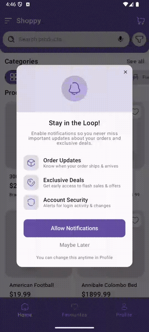
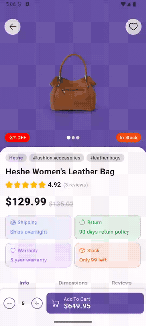
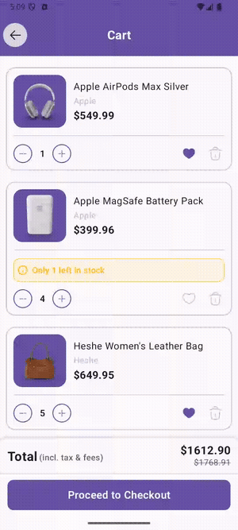
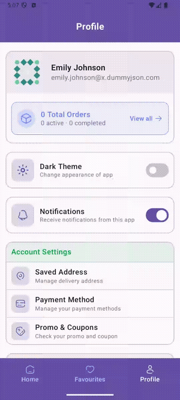
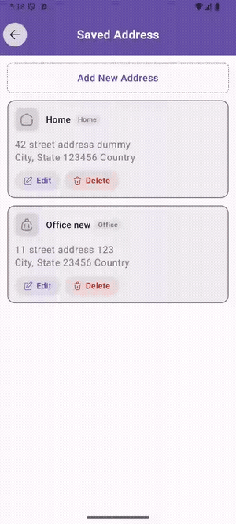

# Shoppy E-Commerce
Full e-commerce Android app · Clean Architecture · Jetpack Compose · Room · Retrofit · Offline-first


A full-featured e-commerce app I built to practice and showcase **Clean Architecture** with **Jetpack Compose**. It covers the entire shopping flow — from browsing products to placing orders — with offline support, encrypted login, and a clean UI.

I wanted to go beyond a simple demo and build something that feels like a real app, with proper architecture layers, local caching, and attention to detail in the UI.

## App Preview

<p align="center">
  
  &nbsp;&nbsp;
  
  &nbsp;&nbsp;
  
</p>

<p align="center">
  
  &nbsp;&nbsp;
  
  &nbsp;&nbsp;
  
</p>

<p align="center">
  
</p>

## Features

- **Browse & Search** — Explore products by category, search by name, and sort/filter results
- **Product Detail** — Image gallery, pricing, reviews, and add-to-cart in one place
- **Cart & Checkout** — Update quantities, apply promo codes, enter shipping details, and place orders
- **Order Tracking** — View order history with status timeline and payment summary
- **Favorites** — Save products you like, persisted locally
- **Address Management** — Add and manage delivery addresses with phone number validation
- **User Profile** — View account info, toggle dark mode, manage notification preferences
- **Secure Login** — Credentials encrypted with AES-256 via EncryptedSharedPreferences
- **Offline First** — Cached data loads instantly, fresh data syncs in the background
- **Dark Mode** — Full dark theme support across all screens

## Built With

| Layer | Tech |
|-------|------|
| **UI** | Jetpack Compose, Material 3, Coil (images + SVG) |
| **Architecture** | Clean Architecture, MVVM, Koin (DI) |
| **Async** | Kotlin Coroutines & Flow |
| **Network** | Retrofit + OkHttp with logging |
| **Local Storage** | Room Database with migrations |
| **Security** | EncryptedSharedPreferences (AES-256) |
| **Navigation** | Type-safe Compose Navigation |

## Architecture

The app follows a **Clean Architecture** pattern with three layers. Each feature module (home, cart, orders, etc.) is self-contained with its own data, domain, and presentation layers.

```
Presentation (Compose UI + ViewModel)
        ↓
Domain (Use Cases + Repository interfaces)
        ↓
Data (Repository impl → Remote API + Local DB)
```

The data layer uses a **local-first approach** — Room provides cached data immediately while Retrofit fetches fresh data in the background. This means the app works even without an internet connection.

## Getting Started

1. Clone the repo and open in Android Studio
2. Sync Gradle and hit Run

**Demo credentials:**
```
Username: emilys
Password: emilyspass
```

> The app uses [DummyJSON API](https://dummyjson.com/) for product and user data.

**Requirements:** Android 7.0+ (API 24) | JDK 11+

## Contact

Built by **Khawaja Moiz** — feel free to reach out!

Email: khwajamoiz406@gmail.com

[GitHub](https://github.com/khawajmoiz406/Android-Compose-Ecommerce)

## License

MIT License — see [LICENSE](LICENSE) for details.
